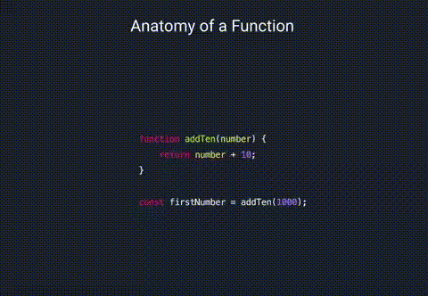

# Lesson 1: Introduction to Functions I (1 hour 30 min)

## Theory
- Explanation of what a function is and its purpose (10 minutes)

---

 :bulb: A function is a block of code that performs a specific task. Functions are defined using the `function` keyword, followed by a name (which is optional), a set of parentheses, and a pair of curly braces that contain the code to be executed when the function is called.
 
  :bulb: Functions can also accept input in the form of parameters, and return output in the form of a return value. This allows for efficient and organized code, and also for the separation of concerns.

  :bulb:The purpose of a function is to group a set of related statements together, so that they can be easily reused throughout a program.



---
- Overview of function syntax in JavaScript (10 minutes)
---
:green_book:The syntax for defining a function is as follows:
```
function functionName(parameter1, parameter2, ...) {
    // code to be executed
    // ...
    // ...
    // ...
}
```

- The `functionName` is an optional identifier that can be used to call the function.
- The `parameter1`, `parameter2`, ... are optional and allow the function to accept input in the form of parameters.
- The code between the curly braces is the body of the function and it will be executed when the function is called.

:green_book:To call a function, with specific arguments you can use the function name followed by parentheses: 
```
functionName(arg1,arg2,arg3);
```

Functions can also return a value using the return statement.

:paperclip: For example:
```
function add(a, b) {
    return a + b;
}
```
This function takes two arguments and returns their sum.


:warning:When a function is called, it creates a new execution context, which includes a new scope for local variables. Any variables defined within that function are only accessible within the function and are not visible outside of it.

It's also worth noting that a function can access variables defined in the parent scope, but not vice versa.

:paperclip:for example : 
```
let outerVariable = "I am an outer variable";
function myFunction() {
  console.log(outerVariable); // "I am an outer variable"
  let innerVariable = "I am an inner variable";
}
console.log(innerVariable); // ReferenceError: innerVariable is not defined
```


---

## Practice
- Demonstration of basic function usage with examples (15 minutes)

- Guided practice creating and calling simple functions (15 minutes)
---
Function Declaration:
```
function greet() {
    console.log("Hello, World!");
}
greet(); // Output: "Hello, World!"
```
This is an example of a simple function declaration that just prints "Hello, World!" when called.

Function with Parameters:
```
function add(a, b) {
    return a + b;
}
console.log(add(2, 3)); // Output: 5
```

This function takes two parameters `a` and `b`, and returns their sum when called.

Function with Default Parameters:

```
function greet(name = "User") {
    console.log(`Hello, ${name}!`);
}
greet(); // Output: "Hello, User!"
greet("John"); // Output: "Hello, John!"
```
This function takes one parameter `name` and it has default value of "User" so it can be optional when calling the function.

:bookmark:***In JavaScript, variables can be defined in different scopes, which determine the accessibility of those variables. There are two main types of scopes: global and local.
A global variable is defined outside of any function and can be accessed from anywhere in the code.***

:paperclip:For example:

```
let globalVariable = "I am a global variable";

function myFunction() {
  console.log(globalVariable); // "I am a global variable"
}
```
***A local variable, on the other hand, is defined inside a function and can only be accessed within that function.***

:paperclip:For example:
```
function myFunction() {
  let localVariable = "I am a local variable";
  console.log(localVariable); // "I am a local variable"
}
console.log(localVariable); // ReferenceError: localVariable is not defined
```

---

## Exercises
- Independent practice creating and calling functions with various parameters and return values (30 minutes)
---

-   Create a function called "findLargest" that takes in three parameters, "a", "b", and "c" and returns the largest of the three numbers.

- Create a function called "concatenate" that takes in two parameters, "str1" and "str2" and returns the concatenation of the two strings.

- Create a function called "isVowel" that takes in one parameter, "letter" and returns a boolean value indicating whether the letter passed in is a vowel or not.

---


- Review and Q&A (10 minutes)

# Lesson 2: Functions II (arrow functions and closure) (1 hour 30 min)

## Theory
- Discussion of arrow functions and their usage (10 minutes)
---
:bulb: An **arrow function** is a shorthand notation for defining a function in JavaScript. It uses the "fat arrow" (`=>`) operator to define the function and has a more concise syntax compared to the traditional function keyword.

:green_book:the syntax : 
```
(param1, param2, ...) => {
  // function body
}
```
or 
```
(param1, param2, ...) => expression
```

- `param1`, `param2`, etc. are the function's parameters. They can be omitted if the function doesn't take any parameters.
- The arrow (`=>`) separates the function's parameters from its body or expression.
- The function body is the set of statements that will be executed when the function is called. *It can be omitted if the function only returns a single expression, which can be written after the arrow*.


---
- Explanation of function closures and their usage (10 minutes)
---

:bulb: A **closure** is a function that has access to the variables in the scope where it was created, even after the function has finished executing and the execution context is destroyed.

:bulb:Closures are created in JavaScript whenever a function is defined inside another function.
:bulb: The inner function has access to the variables in the outer function's scope, even after the outer function has completed execution.
:bulb: This allows the inner function to "remember" the state of the outer function's variables and continue to use them even after the outer function has finished executing.
:green_book:the syntax for closure is as follows:

```
function outerFunction(param1, param2, ...) {
  let variable = value;
  return function innerFunction(innerParam1, innerParam2, ...) {
    // inner function body
  }
}
```

the outer function `outerFunction` takes parameters `param1`, `param2`, etc. Inside the outer function, a variable `variable` is declared and given a value. The inner function innerFunction is defined inside the outer function and takes its own parameters `innerParam1`, `innerParam2`, etc.

:green_book:The outer function then returns the inner function, which can be assigned to a variable.

```
let myClosure = outerFunction(param1, param2);
```

:green_book:The inner function has access to the variables and parameters defined in the outer function, even after the outer function has finished executing, thus creating a closure.

```
let myClosure = outerFunction(param1, param2);
myClosure(innerParam1, innerParam2);
```

:green_book:It is also possible to create closures using arrow function as well.
```
const outerFunction = (param1, param2) => {
  let variable = value;
  return (innerParam1, innerParam2) => {
    // inner function body
  }
}
```

---
<!-- - Overview of recursion and when to use it (10 minutes) -->

## Practice
- Demonstration of arrow function usage with examples (15 minutes)
---

here are some other interesting examples as well : 

 :paperclip: simple function that takes one argument and returns its square: 
```
let square = x => x * x;
console.log(square(5)); // Output: 25
```

:paperclip:  function that takes two arguments and returns their sum: 
```
let add = (a, b) => a + b;
console.log(add(2, 3)); // Output: 5
```

:paperclip:  function that takes no arguments and returns the current date:
```
let getDate = () => new Date();
console.log(getDate()); // Output: current date and time
```

:paperclip: Using arrow function as callback function
```
let numbers = [1, 2, 3, 4, 5];
let doubledNumbers = numbers.map(x => x * 2);
console.log(doubledNumbers); // Output: [2, 4, 6, 8, 10]
```

:paperclip: using arrow function to filter elements in an array
```
let numbers = [1, 2, 3, 4, 5, 6];
let evenNumbers = numbers.filter(x => x % 2 === 0);
console.log(evenNumbers); // Output: [2, 4, 6]
```
---

-  creating and using closures with examples(15 minutes)

:paperclip:function that creates and returns a function that increments a counter variable : 

```
function createCounter() {
    let count = 0;
    return function() {
        count++;
        return count;
    }
}

let counter = createCounter();
console.log(counter()); // outputs 1
console.log(counter()); // outputs 2
console.log(counter()); // outputs 3
```

:paperclip: A function that creates and returns a function that can add a specific amount to a number.

```function createAdder(amount) {
    return function(number) {
        return number + amount;
    }
}

let add5 = createAdder(5);
console.log(add5(3)); // outputs 8
console.log(add5(10)); // outputs 15
```

## Exercises
- Independent practice creating and using arrow functions and closures (30 minutes)

---
1. Arrow function exercise: 
    - Create a simple arrow function that takes in two numbers as arguments and returns their sum.

    - Create an arrow function that takes in an array of numbers and returns the average of the numbers. 
    ***(hint: use `reduce()` array method)***


2. Closure function:
    - Create a closure function that takes in a number and returns a function that will multiply that number by the argument passed to it.

    - Create a closure function that takes in a number and returns a function that will add that number to the argument passed to it.
    -  
---
- Review and Q&A (10 minutes)

<!-- # Lesson 3: Function Practice and Applications (1 hour)

## Theory
- Overview of functional programming concepts and their usage (10 minutes)
- Explanation of higher-order functions and their usage (15 minutes)

## Practice
- Demonstration of functional programming concepts with examples (15 minutes)
- Guided practice creating and using higher-order functions (15 minutes)

## Exercises
- Independent practice creating and using higher-order functions (15 minutes)
- Review and Q&A (10 minutes) -->