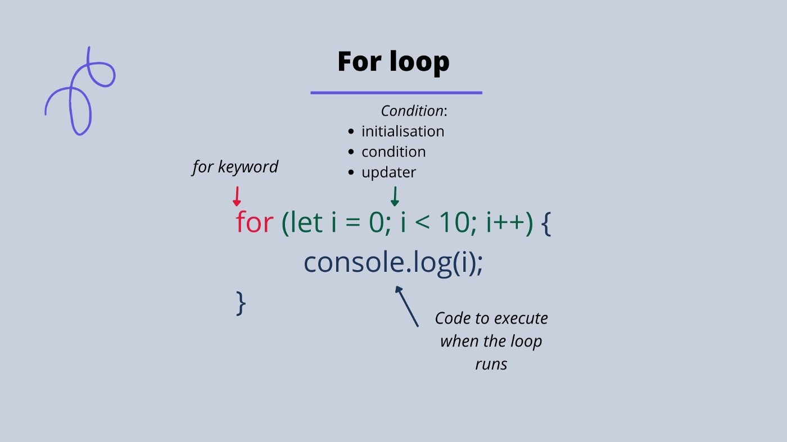

# For loops in Javascript

##  Definition and Illustration

*I will go on and give the definition of a for loop with the right terminologies*

---
### **definition with terminology**


:bulb:A for loop is a  control flow statement  in JavaScript that allows you to iterate over a sequence of values, such as an array or a string.
:bulb: A `for`  loop consists of a block of code that will be executed a specified number of times, as well as a counter variable that keeps track of the number of iterations that have occurred.

---

### **illustration** 

### Actual anatomy of a for loop:




- The for keyword
- The counter variable (this comprises of its initialization, condition and updater).
- The block of code to execute a number of times

*make the students more comfortable with the definition by giving an everyday analogy* 

### **without terminology**
 ----

:bulb:A ***for loop*** is a way to repeat a set of instructions multiple times. It's like a recipe, where you have a list of steps to follow, and you need to repeat those steps a certain number of times.


 let us say you have 5 headless robots, and you want to add to each one of them a head, but you have only the instructions for adding a head to one robot. The for loop allows you to repeat the same instructions on 5 robots or more.


 

 Just like the "head" station in the assembly line in the factory, the for loop has three main parts:

:green_book: **The initialization**: This is like the assembly line station starting to pick up the robot's body

:green_book: **The condition**: This is like the true conditions under which the assembly line keeps running, the loop's instruction will be executed as long as the condition is true.

:green_book: **The updater**: This is like moving the robot to the next station, and bringing in the next robot it will increment the counter variable that is being used and move to the next iteration.

:green_book: **code to execute**:  the actual instruction (recipe) to add a head to a robot.


---

## demonstration

To demonstrate how a `for` loop works, I would use an example of iterating over an array of strings (players of Morocco's soccer national team) and printing each player's name to the console. Here is an example of the code:

:paperclip:
```
let players = ["Ziyech", "Amrabat", "Ounahi", "Hakimi", "Bounou"];
for (let i = 0; i < players.length; i++) {
    console.log( "the current player is " + players[i]);
}


```
*we use a **zero-based indexing** in Javascript, which means that the first element in an array or the first character in a string is at index 0.*

:computer:output in the console:

```
the current player is Ziyech
the current player is Amrabat
the current player is Ounahi
the current player is Hakimi
the current player is Bounou
```


In this for loop, the `counter variable` i is initialized to `0`, and the loop continues to execute as long as `i` is less strictly than the length of the `players` array. At each iteration, the value of `i` is used to access the element at the corresponding index in the `players` array.

---

## Application

The rules of the game are simple:

- Write a program that prints the numbers from 1 to 100
- But for multiples of 3, print "Fizz" instead of the number
- And for multiples of 5, print "Buzz" instead of the number
- For numbers which are multiples of both 3 and 5, print "FizzBuzz"


